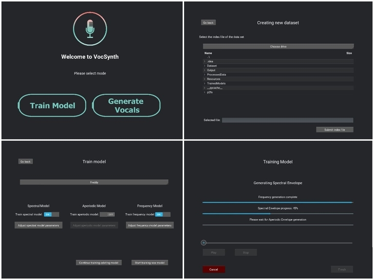

# VocSynth: Neural Singing Synthesizer
## Introduction
This is a neural network based singing synthesizer, heavily inspired by
the "A Neural Parametric Singing Synthesizer Modeling Timbre and
Expression from Natural Songs" paper (https://arxiv.org/abs/1704.03809).

This project was implemented using TensorFlow, and unlike the original
paper, it is implemented such that it can be trained and used with
normal isolated vocal tracks that are readily available instead of
manually recorded and annotated tracks. The project also utilizes the
Penn Phonetics Lab Forced Aligner
(https://github.com/jaekookang/p2fa_py3) as well to enable this.<br />

The training phase requires isolated vocal tracks along with the lyrics
of each track as inputs. During inference, an isolated vocal track of a
different singer and the corresponding lyrics must be given as inputs,
resulting in replacing the vocals with the trained singer's voice and
singing style. As an additional input, the alternative musical notes can
be given to alter the pitch of the vocals as desired. <br/>

There are three models trained and used here.
- Harmonic/Spectral Model: This is used to generate the Harmonic
  Spectral Envelope of the output.
- Aperiodic Model: This is used to generate the Aperiodic Spectral
  Envelope of the output.
- Frequency Model: This is used to generate the Frequency of the output.

The above three outputs are used by the Vocoder to generate the final
audio output.

## Requirements and installation

The project uses **Python 3.6.8**. The libraries required can be
installed by the following command in the project directory. <br/>
```bash
$ pip install -r requirements.txt
```
There are some additional requirements as well to run this program.
- Installing HTK
- Installing Sox
- Installing mysys (For Windows only)

The guide for installing the above requirements on Linux/MacOS was
directly extracted from [here](https://github.com/jaekookang/p2fa_py3).
The Windows installation is more complicated and the guide is included
below.
### Installing requirements on Linux/MacOS
First, you need to download HTK source code (http://htk.eng.cam.ac.uk/).
This HTK installation guide is retrieved from
[Link](https://github.com/prosodylab/Prosodylab-Aligner). Installation
is based on macOS Sierra.

Unzip HTK-3.4.1.tar.gz file

```bash
$ tar -xvf HTK-3.4.1.tar.gz
```

After extracting the tar file, switch to htk directory.

```bash
$ cd htk
```

Compile HTK in the htk directory.

```bash
$ export CPPFLAGS=-UPHNALG
$ ./configure --disable-hlmtools --disable-hslab
$ make clean    # necessary if you're not starting from scratch
$ make -j4 all
$ sudo make -j4 install
```

**Note:** For macOS, you may need to follow these steps before compiling HTK:

```bash
# Add CPPFLAGS
$ export CPPFLAGS=-I/opt/X11/include

# If the above doesn't work, do 
$ ln -s /opt/X11/include/X11 /usr/local/include/X11

# Replace line 21 (#include <malloc.h>) of HTKLib/strarr.c as below
#   include <malloc/malloc.h> 

# Replace line 1650 (labid != splabid) of HTKLib/HRec.c as below
#   labpr != splabid
# This step will prevent "ERROR [+8522] LatFromPaths: Align have dur<=0"
# See: https://speechtechie.wordpress.com/2009/06/12/using-htk-3-4-1-on-mac-os-10-5/

# Compile with options if necessary
$ ./configure
$ make all
$ maek install
```


The following can be used to install Sox.

```bash
$ sudo apt-get install sox

# or in Arch

$ sudo pacman -S sox

# or using brew

$ brew install sox
```
### Windows installation

#### HTK installation
1. As a prerequisite, Microsoft Visual Studio is required to be
   installed in order to build the HTK source. This guide was written
   based on Visual Studio 2019 Community Edition.
2. Register for a free account to obtain a license using this link:
   (http://htk.eng.cam.ac.uk/register.shtml)
3. Download the Windows source code using here:
   (http://htk.eng.cam.ac.uk/download.shtml) and extract it.
4. Open Visual studio, and go to Tools-> Command Line -> Developer
   Command prompt.
5. Using the above terminal carry out the steps 4, 5, 7 and 8 (skip 6)
   in the following link:
   (http://htk.eng.cam.ac.uk/docs/inst-win.shtml). The steps are
   included below as well.
```bash
# cd into the HTK directory

cd htk

mkdir bin.win32

cd HTKLib
nmake /f htk_htklib_nt.mkf all
cd ..

cd HTKTools
nmake /f htk_htktools_nt.mkf all
cd ..
cd HLMLib
nmake /f htk_hlmlib_nt.mkf all
cd ..
cd HLMTools
nmake /f htk_hlmtools_nt.mkf all
cd ..
```

6.  Add the above bin.win32 folder to the PATH.

#### Sox installation
1. Download and install using the executable installer available here:
   (https://sourceforge.net/projects/sox/files/latest/download)
2. Add the installed directory to the PATH

#### MSYS installation
1. Download and install MSYS2 using the steps here:
   (https://www.msys2.org/)
2. Add the *MSYS2-installation-directory*/usr/bin to PATH.


## How to use
This program can be run using a ***command line*** or the ***GUI***.<br
/>  
The input for training the model must be put in the Dataset folder and
must follow the guidelines included in the **Dataset/README.md**<br />  
The ***args.py*** file contains the setting and preferences for the
program and the model.
#### Using the command line
The program can be simply run by running the ***main.py*** file.
```bash
$ python main.py
```
There are multiple options and settings that are included in the
***args.py*** file. These options can be set by either including them in
the command line when executing ***main.py*** or by modifying the
default values for each setting in the ***args.py*** file. Some of basic
settings are included below.

- ``--model_name`` and ``--output_name`` for the names to be used when
  saving the models and the final output.
- ``--load_data``: Once the data is initially read and pre-processed, it
  is saved in the ProcessedData folder. Enabling this option makes sure
  that the training data is directly loaded from here instead of reading
  and pre-processing from the beginning.
-  ``--sp_train`` ``--ap_train`` ``--f_train`` : Enabling these make sre
   the Spectral, Aperiodic and Frequency models are trained
   respectively. Set any to False if you want to skip training them or
   if only inference/generation is required.
-  ``--sp_cont`` ``--ap_cont`` ``--f_cont``: If a model was already
   trained (available in the ***TrainedModels*** folder), by setting
   these to True, we can continue training them further. If set to
   False, the already existing Models will be overwritten and trained
   from the beginning.
-  ``--f_use``: During generating, using the frequency model and its
   output can be skipped. The direct frequency from the input can be
   used if this option is set to False. However for more matching and
   natural results it is recommended to use the frequency model as well
   during inference.
-  All the other options are related to th pre-processing and the model.
   Changing these from the default value may cause some unexpected
   behaviour.

#### Using the GUI

Simply run the ***interface.py*** python file to start the GUI.
```bash
$ python interface.py
```
The GUI can be easily used to train and use the model in an interactive
manner. This can be used from the very first step of pre-processing the
dataset to training the model to finally generating using that model.
The following are some preview screenshots of the GUI.



## References
- The Neural Parametric Singing Synthesizer paper
  (https://arxiv.org/abs/1704.03809).
- The torch NPSS implementation by @seaniezhao
  (https://github.com/seaniezhao/torch_npss)
- Penn Phonetics Lab Forced Aligner by @jaekookang
  (https://github.com/jaekookang/p2fa_py3)

